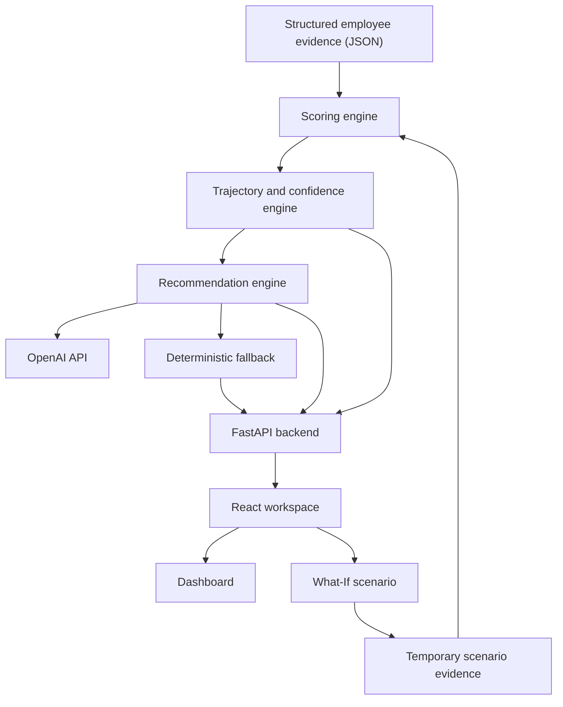

# EvidentIQ
### Evidence-Driven Talent Intelligence & Capability Trajectory Analysis

EvidentIQ is a prototype talent intelligence platform that turns structured employee evidence into a longitudinal view of competency development. Rather than relying on a single performance score, it analyzes how competencies change across assessment cycles, surfaces confidence and evidence limitations, and provides AI-assisted development guidance.

> **Project:** HackMatrix 5.0 prototype  
> **Focus:** Continuous Talent Intelligence & Skill Growth

## Contents

- [Overview](#overview)
- [Features](#features)
- [Architecture](#architecture)
- [Technology Stack](#technology-stack)
- [Repository Structure](#repository-structure)
- [Getting Started](#getting-started)
- [Configuration](#configuration)
- [Run the Application](#run-the-application)
- [API Reference](#api-reference)
- [How It Works](#how-it-works)
- [Tests](#tests)
- [Limitations and Responsible Use](#limitations-and-responsible-use)
- [Roadmap](#roadmap)

## Overview

Employee capability changes through projects, training, feedback, collaboration, and new responsibilities. Periodic ratings can miss those changes and often do not make the evidence or uncertainty behind a rating visible.

EvidentIQ is designed to help explore four questions:

1. How has a competency changed across assessment cycles?
2. What evidence is associated with that trajectory?
3. How much confidence should be placed in the assessment?
4. Where is more evidence needed before drawing conclusions?

The current prototype works with structured JSON employee data and includes five competency dimensions: Technical Depth, Communication, Leadership, Collaboration, and Adaptability.

## Features

### Evidence-based competency scoring
The scoring engine evaluates structured evidence using the evidence weights and calculation rules defined in the backend.

### Longitudinal trajectories
The trajectory engine derives competency trends and changes across assessment cycles, rather than treating a single score as a complete picture.

### Confidence and insufficient-evidence flags
The system includes confidence-related information and flags limited evidence. In the current implementation, insufficient evidence is flagged when the configured minimum of two cycles or two evidence items is not met.

### AI-assisted development recommendations
The recommendation engine can use the OpenAI Chat Completions API to produce structured coaching guidance. Returned evidence identifiers are checked against the evidence identifiers available to the engine. When AI generation is unavailable or unusable, the recommendation pipeline has a deterministic fallback.

### What-If simulation
The API accepts hypothetical signals for an employee and competency, evaluates a temporary scenario against a baseline, and returns calculated results. The simulation uses temporary copies of the data; it is intended for exploration, not as a record of observed performance.

### Web workspace
A React-based frontend provides the employee workspace and communicates with the FastAPI backend.

## Architecture



**Design principle:** Python scoring and trajectory calculations are the source of truth for numerical results. The language model is used for interpretation and coaching text, not to independently calculate or override the metrics.

## Technology Stack

| Layer | Technologies |
|---|---|
| Frontend | React 19, Vite, Tailwind CSS v4 |
| UI / visualization | Lucide React, Spline 3D Runtime |
| Backend | Python, FastAPI |
| Data | Structured JSON |
| AI integration | OpenAI Chat Completions API |
| Tests | Python `unittest` |

## Repository Structure

Principal project files and modules:

```text
EvidentIQ/
├── backend_api.py
├── run_pipeline.py
├── requirements.txt
├── data/
│   └── raw_dataset.json
├── scoring/
│   ├── score_engine.py
│   └── tests/
├── trajectory/
│   ├── trajectory_engine.py
│   └── tests/
├── recommendation/
│   ├── recommendation_engine.py
│   ├── fallback.json
│   ├── prompts/
│   └── tests/
└── frontend/
    ├── src/
    ├── public/
    └── package.json
```

Generated files and additional frontend components may be present in the repository but are omitted from this overview.

## Getting Started

### Prerequisites

- Python 3.10 or newer
- Node.js and npm
- Git
- An OpenAI API key for AI-generated recommendations (optional for deterministic processing and fallback)

Check your installations:

```bash
python --version
node --version
npm --version
git --version
```

### 1. Clone the repository

```bash
git clone https://github.com/Ishan-014/EvidentIQ.git
cd EvidentIQ
```

### 2. Set up the Python environment

Create and activate a virtual environment.

**Windows PowerShell:**

```powershell
python -m venv .venv
.\.venv\Scripts\Activate.ps1
python -m pip install -r requirements.txt
```

**macOS / Linux:**

```bash
python3 -m venv .venv
source .venv/bin/activate
python -m pip install -r requirements.txt
```

If PowerShell prevents environment activation, review your local PowerShell execution policy or activate the environment using the appropriate command for your shell.

### 3. Set up environment variables

If the repository contains `.env.example`, copy it to a local `.env` and fill in the values you need. Do not commit the real `.env` file or expose API keys.

The recommendation module reads environment variables directly. Ensure they are available in the backend process before starting it.

### 4. Install frontend dependencies

```bash
cd frontend
npm install
cd ..
```

## Configuration

The recommendation engine supports these environment variables:

| Variable | Purpose | Default |
|---|---|---|
| `OPENAI_API_KEY` | API key for AI generation | Unset |
| `OPENAI_BASE_URL` | OpenAI-compatible API base URL | `https://api.openai.com/v1` |
| `OPENAI_MODEL` | Model identifier | `gpt-4o-mini` |
| `TRAJECTORY_INPUT` | Input path for the recommendation runner | `trajectory/trajectory_output.json` |
| `RECOMMENDATION_OUT` | Output path for generated recommendations | `recommendation/recommendations.json` |

The API reads its raw dataset, prompt, and fallback files from paths relative to the backend project directory. AI features require a valid API configuration and network access; deterministic scoring does not require a successful model call.

## Run the Application

Run the backend and frontend in separate terminals from the repository root.

### Backend

Activate the Python virtual environment, then run:

```bash
python -m uvicorn backend_api:app --reload
```

By default, the API is available at:

- API: http://127.0.0.1:8000
- Interactive Swagger docs: http://127.0.0.1:8000/docs
- Health check: http://127.0.0.1:8000/api/health

### Frontend

```bash
cd frontend
npm run dev
```

Open the Vite URL printed in the terminal (typically http://localhost:5173).

### Run the data pipeline

From the repository root, with the Python environment activated:

```bash
python run_pipeline.py
```

This runs the project's pipeline entry point. Output files and behavior depend on the current pipeline configuration.

## API Reference

The interactive API documentation at `/docs` provides request and response schemas available in the running version.

| Method | Endpoint | Purpose |
|---|---|---|
| `GET` | `/` | Basic service information |
| `GET` | `/api/health` | Health check |
| `GET` | `/api/dashboard` | Return dashboard trajectory and recommendation data |
| `POST` | `/api/what-if/analyze` | Score a hypothetical competency scenario |
| `POST` | `/api/dashboard/refresh` | Clear dashboard cache and regenerate data |

### What-If request

`POST /api/what-if/analyze`

Example request body (replace the employee ID and evidence type with values supported by the dataset and scoring engine):

```json
{
  "employee_id": "EMP001",
  "competency": "technical_depth",
  "signals": [
    {
      "id": "scenario_001",
      "type": "project_delivery",
      "source": "scenario",
      "value": 90,
      "description": "Hypothetical completion of an advanced engineering project."
    }
  ]
}
```

The endpoint validates the employee, competency, and signal fields, then returns the baseline, scenario, and analysis objects. The accepted evidence types are defined by `EVIDENCE_WEIGHTS` in the scoring engine. The endpoint currently accepts 1–20 signals, with numeric values from 0 to 100.

The exact response fields depend on the scoring and recommendation engines. Consult the live Swagger documentation for the running implementation.

## How It Works

1. **Load evidence:** Employee and competency evidence is read from the configured JSON dataset.
2. **Score competencies:** The scoring engine applies its configured evidence weights and calculation rules.
3. **Compute trajectories:** The trajectory engine derives trends, changes, and confidence-related information from scored data.
4. **Generate coaching guidance:** The recommendation engine sends relevant trajectory and evidence context to the configured model, then validates returned evidence identifiers.
5. **Use fallback when needed:** If model output is unavailable or unusable, the recommendation pipeline can produce deterministic fallback guidance.
6. **Explore scenarios:** The What-If endpoint copies the selected employee data, adds hypothetical evidence to the scenario copy, and recalculates the baseline and scenario through the scoring and trajectory engines.

Evidence identifier validation confirms that cited identifiers exist in the supplied evidence pool. It does not prove that every natural-language claim is fully supported by the cited evidence.

## Tests

Run the unit-test suites from the repository root with the Python environment activated:

```bash
python -m unittest discover trajectory/tests
python -m unittest discover scoring/tests
python -m unittest discover recommendation/tests
```

These commands run the corresponding unit-test directories. They do not establish that a live OpenAI request succeeds or that the complete frontend-to-backend application has been tested end to end.

## Limitations and Responsible Use

EvidentIQ is a prototype for talent intelligence and employee development. Its outputs depend on the quality, completeness, and representativeness of the source data.

- Limited or biased evidence can produce incomplete or misleading assessments.
- Confidence indicators are estimates based on the implemented rules, not guarantees of correctness.
- AI-generated text can be inaccurate or unsupported, even when cited evidence IDs are valid.
- What-If outputs describe hypothetical scenarios, not observed employee behavior or guaranteed future outcomes.
- Employee data is sensitive. A production deployment requires appropriate consent, access controls, security, retention policies, and privacy safeguards.

**Do not use EvidentIQ as the sole basis for hiring, firing, promotion, compensation, or other consequential employment decisions.** Keep qualified human review and appropriate employee safeguards in the decision process.

## Roadmap

Potential future improvements include:

- Connectors for HR, learning, project, and feedback systems.
- Stronger evidence provenance and source-independence analysis.
- Claim-level verification of AI recommendations against cited evidence.
- Better confidence calibration and explanations of uncertainty.
- Expanded API validation and end-to-end tests for What-If workflows.
- Configurable role-specific competency frameworks and development plans.
- Production-grade authentication, authorization, privacy, and audit controls.

These items are potential enhancements and should not be interpreted as features already implemented.

## Contributing

Contributions and suggestions are welcome.

1. Fork the repository.
2. Create a feature branch.
3. Make changes and add or update tests.
4. Run relevant tests.
5. Open a pull request describing the change.

Do not include API keys, private employee information, or other sensitive data in commits.

## License

No license terms are declared in this README. Check the repository for a license file before using, modifying, or redistributing the project.

---

**EvidentIQ — From static performance scores to evidence-driven capability growth.**
